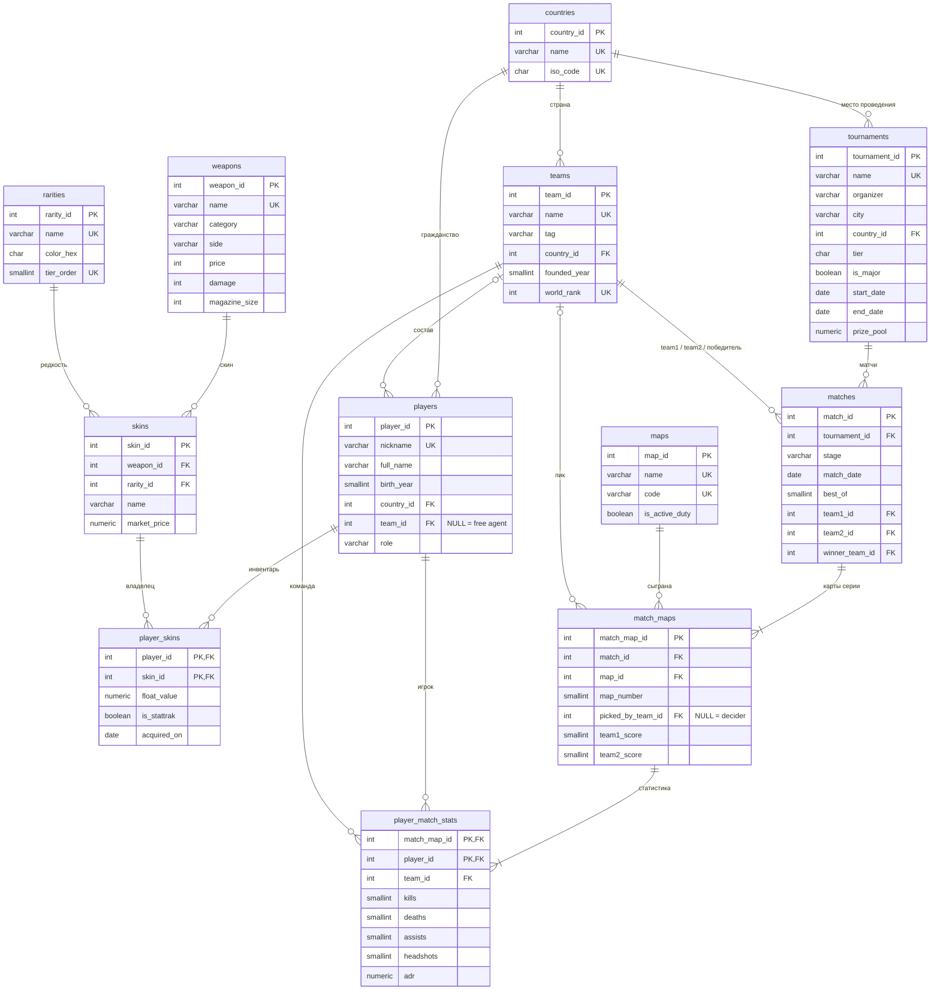

# База данных «Counter-Strike 2: киберспорт»

**Домашнее задание** по дисциплине «Data mühəndisliyinə giriş»

|  |  |
|---|---|
| **Студент** | Насиров Музаффар, группа 6223r |
| **Преподаватель** | Cəlal Mehdiyev |
| **Университет** | Азербайджанский технический университет (AzTU) |
| **Дата** | 30.09.2026 |
| **СУБД** | PostgreSQL 14+ |

---

## 1. Задание

Создать реляционную базу данных, содержащую не менее 7 таблиц, на тему любимой компьютерной игры.

## 2. Предметная область

Выбрана игра **Counter-Strike 2** — тактический шутер и одна из крупнейших киберспортивных дисциплин.
База данных описывает профессиональную сцену и игровые предметы:

- **киберспорт:** страны, команды, игроки и их роли, турниры, матчи (серии BO1/BO3/BO5), сыгранные карты и индивидуальная статистика игроков на каждой карте;
- **игра:** карты (маппул), оружие с игровыми характеристиками, скины, редкость скинов и инвентарь игроков (float, StatTrak™).

Итого: **12 таблиц**, 2 представления (VIEW), 5 индексов, 19 запросов.

## 3. Структура репозитория

```
├── README.md              ← отчёт
├── er_diagram.html        ← ER-диаграмма (открыть в браузере)
└── sql/
    ├── 01_schema.sql      ← создание таблиц (DDL)
    ├── 02_data.sql        ← заполнение данными (DML)
    └── 03_queries.sql     ← представления и запросы
```

## 4. ER-диаграмма



## 5. Описание таблиц

| # | Таблица | Назначение | Связи | Строк |
|---|---|---|---|---|
| 1 | `countries` | Страны | — | 20 |
| 2 | `teams` | Команды: название, тег, год основания, место в мировом рейтинге | → countries | 5 |
| 3 | `players` | Игроки: ник, имя, год рождения, роль (IGL, AWPer, Entry, Rifler, Lurker, Support) | → countries, → teams | 27 |
| 4 | `maps` | Карты и признак «в активном маппуле» | — | 9 |
| 5 | `weapons` | Оружие: категория, сторона (T/CT), цена, урон, магазин | — | 21 |
| 6 | `rarities` | Редкость скинов (Consumer Grade → Contraband) и её цвет | — | 7 |
| 7 | `skins` | Скины оружия и рыночная цена | → weapons, → rarities | 21 |
| 8 | `player_skins` | Инвентарь: какой скин у какого игрока, float, StatTrak™ | **M:N** players ↔ skins | 22 |
| 9 | `tournaments` | Турниры: организатор, город, уровень, Major, даты, призовой фонд | → countries | 5 |
| 10 | `matches` | Матчи (серии BO1/BO3/BO5) между двумя командами | → tournaments, → teams ×3 | 10 |
| 11 | `match_maps` | Карты, сыгранные в матче: порядок, кто выбрал, счёт | **M:N** matches ↔ maps | 29 |
| 12 | `player_match_stats` | Статистика игрока на карте: K / D / A, хедшоты, ADR | **M:N** players ↔ match_maps | 290 |

### Связи

- **Один-ко-многим:** страна → команды / игроки / турниры; команда → игроки; оружие → скины; редкость → скины; турнир → матчи.
- **Многие-ко-многим** реализованы через связующие таблицы с собственными атрибутами:
  - `player_skins` — игрок ↔ скин (float, StatTrak™, дата получения);
  - `match_maps` — матч ↔ карта (номер карты, пик, счёт);
  - `player_match_stats` — игрок ↔ сыгранная карта (kills, deaths, ADR…).
- **Необязательная связь:** `players.team_id` может быть `NULL` — игрок без команды (free agent).

## 6. Ограничения целостности

Помимо первичных и внешних ключей, в схему заложены правила самой игры:

| Ограничение | Где | Смысл |
|---|---|---|
| `CHECK (team1_id <> team2_id)` | `matches` | команда не может играть сама с собой |
| `CHECK (winner_team_id IN (team1_id, team2_id))` | `matches` | победитель — один из участников |
| `CHECK (best_of IN (1, 3, 5))` | `matches` | допустимые форматы серий |
| `CHECK (team1_score <> team2_score)` и `GREATEST(...) >= 13` | `match_maps` | формат MR12: ничьих нет, победитель набирает минимум 13 раундов |
| `UNIQUE (match_id, map_id)` | `match_maps` | одна карта не играется дважды в серии |
| `CHECK (headshots <= kills)` | `player_match_stats` | хедшотов не больше, чем убийств |
| `CHECK (float_value >= 0 AND float_value < 1)` | `player_skins` | допустимый диапазон float |
| `CHECK (color_hex ~ '^#[0-9A-F]{6}$')` | `rarities` | цвет в HEX-формате (регулярное выражение) |
| `CHECK (end_date >= start_date)` | `tournaments` | турнир не заканчивается раньше начала |
| `CHECK (role IN (...))`, `CHECK (category IN (...))` | `players`, `weapons` | только допустимые роли и категории |

Поведение при удалении:
- `ON DELETE SET NULL` — если удалить команду, её игроки становятся свободными агентами;
- `ON DELETE CASCADE` — если удалить матч, удаляются его карты и статистика.

Схема находится в **3-й нормальной форме**: справочные данные (страны, редкости, оружие, карты) вынесены в отдельные таблицы и не дублируются.

## 7. Заполнение данными

Файл `sql/02_data.sql`. Справочники и матчи вставлены обычными `INSERT`.
Статистика игроков (**290 строк** = 29 карт × 10 игроков) не вводится вручную, а **генерируется** одним запросом `INSERT ... SELECT` с CTE:
по каждой сыгранной карте берутся игроки обеих команд, и детерминированная формула вычисляет kills, deaths, assists, хедшоты и ADR.
Игроки команды, выигравшей карту, получают больше убийств и меньше смертей, поэтому статистика согласуется с результатами матчей.

> Составы команд приближены к сезону 2025 года. Результаты матчей, статистика и цены скинов — учебные данные.
> Турнир «Baku CS2 Open 2026» вымышленный: он добавлен как турнир без сыгранных матчей для демонстрации `LEFT JOIN`.

## 8. Запросы и результаты

Все запросы — в `sql/03_queries.sql`. Используемые приёмы SQL:

| Приём | Запросы |
|---|---|
| `INNER JOIN` нескольких таблиц | Q1, Q10, Q11, Q14 |
| `LEFT JOIN` + `IS NULL`, `COALESCE` | Q2, Q7, Q9, Q13, Q16 |
| Представления (VIEW) | Q3, Q4, Q5, Q12 |
| `GROUP BY`, `HAVING`-подобная фильтрация, агрегаты с `FILTER` | Q6, Q7, Q15, Q16 |
| CTE (`WITH`), `UNION ALL` | Q6, Q8, Q10 |
| Оконные функции `ROW_NUMBER`, `RANK`, `DENSE_RANK`, `AVG OVER` | Q5, Q8, Q10, Q15, Q18 |
| Коррелированный подзапрос | Q12 |
| `NOT EXISTS` | Q17 |
| `CASE`, конкатенация строк, `STRING_AGG` | Q13, Q14 |
| Транзакция `BEGIN … ROLLBACK` | Q19 |

Ниже — результаты некоторых запросов (получены на PostgreSQL).

### Q3. Результаты матчей (представление `v_match_results`)

| Турнир | Стадия | Дата | Команда 1 | Команда 2 | Счёт | Победитель |
|---|---|---|---|---|:-:|---|
| IEM Katowice 2025 | Semi-final | 2025-02-08 | Team Vitality | FaZe Clan | 2:1 | Team Vitality |
| IEM Katowice 2025 | Semi-final | 2025-02-08 | Team Spirit | MOUZ | 2:0 | Team Spirit |
| IEM Katowice 2025 | Final | 2025-02-09 | Team Vitality | Team Spirit | 3:1 | Team Vitality |
| PGL Astana 2025 | Semi-final | 2025-05-17 | Natus Vincere | FaZe Clan | 2:1 | Natus Vincere |
| PGL Astana 2025 | Final | 2025-05-18 | Natus Vincere | MOUZ | 1:2 | MOUZ |
| BLAST.tv Austin Major 2025 | Quarter-final | 2025-06-19 | Team Vitality | Natus Vincere | 2:0 | Team Vitality |
| BLAST.tv Austin Major 2025 | Quarter-final | 2025-06-19 | Team Spirit | FaZe Clan | 1:2 | FaZe Clan |
| BLAST.tv Austin Major 2025 | Semi-final | 2025-06-21 | MOUZ | FaZe Clan | 2:0 | MOUZ |
| BLAST.tv Austin Major 2025 | Final | 2025-06-22 | Team Vitality | MOUZ | 2:1 | Team Vitality |
| IEM Cologne 2025 | Final | 2025-08-10 | Team Spirit | Natus Vincere | 3:1 | Team Spirit |

### Q4. TOP-10 игроков по K/D (минимум 5 карт)

| Игрок | Команда | Роль | Карт | Kills | Deaths | K/D | ADR | HS % |
|---|---|---|--:|--:|--:|--:|--:|--:|
| ZywOo | Team Vitality | AWPer | 12 | 250 | 178 | 1.40 | 109.8 | 58.8 |
| donk | Team Spirit | Entry | 13 | 269 | 209 | 1.29 | 101.6 | 37.9 |
| flameZ | Team Vitality | Entry | 12 | 212 | 168 | 1.26 | 96.5 | 53.8 |
| mezii | Team Vitality | Support | 12 | 203 | 162 | 1.25 | 92.5 | 37.4 |
| apEX | Team Vitality | IGL | 12 | 211 | 172 | 1.23 | 92.5 | 45.0 |
| ropz | Team Vitality | Lurker | 12 | 203 | 167 | 1.22 | 91.4 | 40.9 |
| Jimpphat | MOUZ | Support | 10 | 162 | 145 | 1.12 | 90.1 | 38.9 |
| zweih | Team Spirit | Support | 13 | 227 | 208 | 1.09 | 89.9 | 48.9 |
| zont1x | Team Spirit | Rifler | 13 | 217 | 201 | 1.08 | 84.7 | 34.1 |
| chopper | Team Spirit | IGL | 13 | 219 | 208 | 1.05 | 83.6 | 55.3 |

### Q6. Статистика команд

| Команда | Матчей | Побед | Поражений | Winrate |
|---|--:|--:|--:|--:|
| Team Vitality | 4 | 4 | 0 | 100.0 % |
| Team Spirit | 4 | 2 | 2 | 50.0 % |
| MOUZ | 4 | 2 | 2 | 50.0 % |
| FaZe Clan | 4 | 1 | 3 | 25.0 % |
| Natus Vincere | 4 | 1 | 3 | 25.0 % |

### Q7. Статистика карт

| Карта | В маппуле | Сыграна | Пик | Decider | Ср. раундов | Овертаймы |
|---|:-:|--:|--:|--:|--:|--:|
| Mirage | ✔ | 6 | 6 | 0 | 22.3 | 0 |
| Inferno | ✔ | 5 | 3 | 2 | 20.8 | 0 |
| Nuke | ✔ | 5 | 4 | 1 | 20.8 | 0 |
| Ancient | ✔ | 4 | 3 | 1 | 24.8 | 1 |
| Dust II | ✔ | 4 | 4 | 0 | 23.0 | 0 |
| Anubis | ✔ | 3 | 2 | 1 | 23.3 | 1 |
| Train | ✔ | 2 | 2 | 0 | 22.5 | 0 |
| Overpass | ✘ | 0 | 0 | 0 | — | 0 |
| Vertigo | ✘ | 0 | 0 | 0 | — | 0 |

### Q9. Турниры и чемпионы

| Турнир | Город | Уровень | Major | Призовой фонд, $ | Чемпион |
|---|---|:-:|:-:|--:|---|
| IEM Katowice 2025 | Katowice | S | | 1 000 000 | Team Vitality |
| PGL Astana 2025 | Astana | A | | 625 000 | MOUZ |
| BLAST.tv Austin Major 2025 | Austin | S | ✔ | 1 250 000 | Team Vitality |
| IEM Cologne 2025 | Cologne | S | | 1 000 000 | Team Spirit |
| Baku CS2 Open 2026 | Baku | B | | 50 000 | — hələ məlum deyil — |

### Q10. MVP финалов (больше всего убийств за серию)

| Турнир | MVP | Команда | Kills | Deaths |
|---|---|---|--:|--:|
| IEM Katowice 2025 | ZywOo | Team Vitality | 91 | 62 |
| PGL Astana 2025 | Jimpphat | MOUZ | 52 | 41 |
| BLAST.tv Austin Major 2025 | ZywOo | Team Vitality | 61 | 48 |
| IEM Cologne 2025 | donk | Team Spirit | 77 | 57 |

### Q15. Самые дорогие инвентари

| Место | Игрок | Команда | Скинов | Стоимость, $ | Самый дорогой скин, $ |
|--:|---|---|--:|--:|--:|
| 1 | s1mple | Free agent | 3 | 16 950.00 | 11 000.00 |
| 2 | ZywOo | Team Vitality | 3 | 11 255.00 | 11 000.00 |
| 3 | donk | Team Spirit | 3 | 1 654.00 | 1 600.00 |
| 4 | b1t | Natus Vincere | 2 | 1 470.00 | 1 400.00 |
| 5 | torzsi | MOUZ | 1 | 420.00 | 420.00 |

Пример запроса Q10 (CTE + оконная функция):

```sql
WITH final_stats AS (
    SELECT tr.name AS tournament, p.nickname, tm.name AS team,
           SUM(s.kills) AS kills, SUM(s.deaths) AS deaths,
           ROW_NUMBER() OVER (PARTITION BY m.match_id
                              ORDER BY SUM(s.kills) DESC, SUM(s.deaths)) AS rn
    FROM matches m
    JOIN tournaments tr       ON tr.tournament_id = m.tournament_id
    JOIN match_maps mm        ON mm.match_id      = m.match_id
    JOIN player_match_stats s ON s.match_map_id   = mm.match_map_id
    JOIN players p            ON p.player_id      = s.player_id
    JOIN teams tm             ON tm.team_id       = s.team_id
    WHERE m.stage = 'Final'
    GROUP BY m.match_id, tr.name, p.player_id, tm.name
)
SELECT tournament, nickname AS mvp, team, kills, deaths
FROM final_stats
WHERE rn = 1;
```

## 9. Как запустить

1. Установить PostgreSQL и создать пустую базу, например `cs2`.
2. Выполнить скрипты по порядку (в DataGrip, pgAdmin или `psql`):

```bash
psql -d cs2 -f sql/01_schema.sql
psql -d cs2 -f sql/02_data.sql
psql -d cs2 -f sql/03_queries.sql
```

`01_schema.sql` сначала удаляет старые объекты, поэтому скрипты можно запускать повторно.

## 10. Вывод

Разработана реляционная база данных из 12 таблиц о киберспортивной сцене Counter-Strike 2 и игровых предметах.
Схема нормализована до 3НФ и содержит три связи «многие-ко-многим».
Бизнес-правила игры (формат MR12, участники матча, float скинов) проверяются на уровне СУБД через `CHECK`, `UNIQUE` и внешние ключи.
Для большого объёма статистики применена генерация данных через `INSERT ... SELECT`.
Написанные запросы — соединения, агрегаты, CTE, оконные функции, подзапросы, представления и транзакция — позволяют аналитически обрабатывать данные: строить рейтинги игроков, считать winrate команд, определять MVP финалов и стоимость инвентарей.
