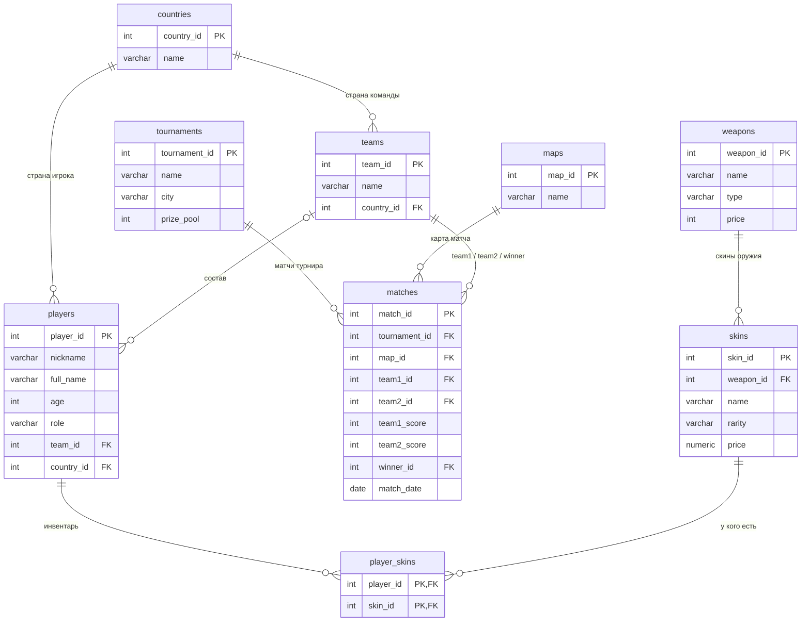

# База данных «Counter-Strike 2»

**Домашнее задание** по дисциплине «Data mühəndisliyinə giriş»

|  |  |
|---|---|
| **Студент** | Насиров Музаффар, группа 6223r |
| **Преподаватель** | Cəlal Mehdiyev |
| **Университет** | Азербайджанский технический университет (AzTU) |
| **Дата** | 30.09.2026 |
| **СУБД** | PostgreSQL |

---

## 1. Задание

Создать базу данных минимум из 7 таблиц на тему любимой игры.

## 2. Тема

**Counter-Strike 2** — командный шутер и популярная киберспортивная игра.
В базе хранится информация о командах, игроках, турнирах и матчах, а также об оружии и скинах (раскрасках оружия), которые есть у игроков.

## 3. Файлы

```
├── README.md            ← отчёт
├── er_diagram.html      ← ER-диаграмма (открыть в браузере)
└── sql/
    ├── 01_schema.sql    ← создание таблиц
    ├── 02_data.sql      ← заполнение данными
    └── 03_queries.sql   ← запросы
```

## 4. ER-диаграмма



## 5. Таблицы

| # | Таблица | Что хранит | Связана с | Строк |
|---|---|---|---|--:|
| 1 | `countries` | Страны | — | 14 |
| 2 | `teams` | Команды | countries | 4 |
| 3 | `players` | Игроки: ник, имя, возраст, роль | teams, countries | 21 |
| 4 | `tournaments` | Турниры: название, город, призовой фонд | — | 4 |
| 5 | `maps` | Игровые карты | — | 7 |
| 6 | `matches` | Матчи: турнир, карта, две команды, счёт, победитель | tournaments, maps, teams | 9 |
| 7 | `weapons` | Оружие: тип и цена в игре | — | 10 |
| 8 | `skins` | Скины для оружия: редкость и цена | weapons | 11 |
| 9 | `player_skins` | Какие скины есть у каких игроков | players, skins | 12 |

**Виды связей:**
- **Один-ко-многим.** В одной команде много игроков, в одном турнире много матчей, у одного оружия много скинов.
- **Многие-ко-многим.** У игрока может быть много скинов, а один скин может быть у многих игроков. Такая связь сделана через таблицу `player_skins`.
- **Необязательная связь.** У игрока может не быть команды (`team_id` = NULL), например у s1mple.

**Ограничения:**
- `PRIMARY KEY` — уникальный номер строки в каждой таблице.
- `FOREIGN KEY` (`REFERENCES`) — нельзя сослаться на несуществующую команду, карту или турнир.
- `NOT NULL` и `UNIQUE` — у команды, игрока и турнира обязательно есть название, и оно не повторяется.
- `CHECK` — возраст больше 0, цены не отрицательные, команда не может играть сама с собой.

## 6. Запросы и результаты

Все 13 запросов находятся в файле `sql/03_queries.sql`. Ниже несколько примеров с результатами.

### Все матчи (JOIN пяти таблиц)

```sql
SELECT tr.name AS tournament, m.name AS map, t1.name AS team1,
       mt.team1_score || ' : ' || mt.team2_score AS score,
       t2.name AS team2, w.name AS winner
FROM matches mt
JOIN tournaments tr ON mt.tournament_id = tr.tournament_id
JOIN maps m         ON mt.map_id   = m.map_id
JOIN teams t1       ON mt.team1_id = t1.team_id
JOIN teams t2       ON mt.team2_id = t2.team_id
JOIN teams w        ON mt.winner_id = w.team_id
ORDER BY mt.match_date;
```

| Турнир | Карта | Команда 1 | Счёт | Команда 2 | Победитель |
|---|---|---|:-:|---|---|
| IEM Katowice 2025 | Mirage | Team Vitality | 13 : 9 | FaZe Clan | Team Vitality |
| IEM Katowice 2025 | Dust II | Team Spirit | 13 : 11 | Natus Vincere | Team Spirit |
| IEM Katowice 2025 | Inferno | Team Vitality | 13 : 10 | Team Spirit | Team Vitality |
| BLAST.tv Austin Major 2025 | Nuke | Natus Vincere | 13 : 7 | FaZe Clan | Natus Vincere |
| BLAST.tv Austin Major 2025 | Ancient | Team Spirit | 11 : 13 | FaZe Clan | FaZe Clan |
| BLAST.tv Austin Major 2025 | Mirage | Team Vitality | 13 : 5 | Natus Vincere | Team Vitality |
| BLAST.tv Austin Major 2025 | Anubis | Team Vitality | 16 : 14 | FaZe Clan | Team Vitality |
| IEM Cologne 2025 | Dust II | Team Spirit | 13 : 8 | Team Vitality | Team Spirit |
| IEM Cologne 2025 | Inferno | Natus Vincere | 9 : 13 | Team Spirit | Team Spirit |

### Количество побед у каждой команды (GROUP BY + COUNT)

```sql
SELECT t.name AS team, COUNT(*) AS wins
FROM matches m
JOIN teams t ON m.winner_id = t.team_id
GROUP BY t.name
ORDER BY wins DESC;
```

| Команда | Побед |
|---|--:|
| Team Vitality | 4 |
| Team Spirit | 3 |
| FaZe Clan | 1 |
| Natus Vincere | 1 |

### Средний возраст игроков в команде (GROUP BY + AVG)

```sql
SELECT t.name AS team, ROUND(AVG(p.age), 1) AS avg_age
FROM players p
JOIN teams t ON p.team_id = t.team_id
GROUP BY t.name
ORDER BY avg_age;
```

| Команда | Средний возраст |
|---|--:|
| Team Spirit | 22.0 |
| Natus Vincere | 24.4 |
| Team Vitality | 26.4 |
| FaZe Clan | 28.2 |

### Стоимость инвентаря игроков (связь многие-ко-многим + SUM)

```sql
SELECT p.nickname, COUNT(*) AS skins_count, SUM(s.price) AS total_price
FROM player_skins ps
JOIN players p ON ps.player_id = p.player_id
JOIN skins s   ON ps.skin_id   = s.skin_id
GROUP BY p.nickname
ORDER BY total_price DESC;
```

| Игрок | Скинов | Стоимость, $ |
|---|--:|--:|
| s1mple | 3 | 16 950.00 |
| ZywOo | 2 | 11 160.00 |
| donk | 2 | 1 645.00 |
| b1t | 1 | 1 400.00 |
| sh1ro | 1 | 160.00 |
| rain | 1 | 110.00 |
| apEX | 1 | 95.00 |
| broky | 1 | 0.25 |

### Сколько раз сыграна каждая карта (LEFT JOIN)

```sql
SELECT mp.name AS map, COUNT(m.match_id) AS times_played
FROM maps mp
LEFT JOIN matches m ON m.map_id = mp.map_id
GROUP BY mp.name
ORDER BY times_played DESC;
```

| Карта | Сыграна раз |
|---|--:|
| Dust II | 2 |
| Mirage | 2 |
| Inferno | 2 |
| Anubis | 1 |
| Nuke | 1 |
| Ancient | 1 |
| Train | 0 |

Карта Train ни разу не сыграна, но всё равно видна в результате, потому что использован `LEFT JOIN`.

### Оружие дороже среднего (подзапрос)

```sql
SELECT name, type, price
FROM weapons
WHERE price > (SELECT AVG(price) FROM weapons)
ORDER BY price DESC;
```

| Оружие | Тип | Цена, $ |
|---|---|--:|
| AWP | Sniper | 4750 |
| M4A4 | Rifle | 3100 |
| M4A1-S | Rifle | 2900 |
| AK-47 | Rifle | 2700 |

## 7. Как запустить

1. Установить PostgreSQL и создать базу `cs2`.
2. По очереди выполнить три файла из папки `sql/`: `01_schema.sql` → `02_data.sql` → `03_queries.sql`. Подойдёт DataGrip, pgAdmin или psql.

## 8. Вывод

Создана база данных из 9 таблиц об игре Counter-Strike 2. Таблицы связаны первичными и внешними ключами. Есть связи «один-ко-многим» и «многие-ко-многим».
Таблицы заполнены данными о реальных командах и игроках. Написаны запросы с `JOIN`, `WHERE`, `GROUP BY`, агрегатными функциями (`COUNT`, `SUM`, `AVG`), `LEFT JOIN` и подзапросом.
